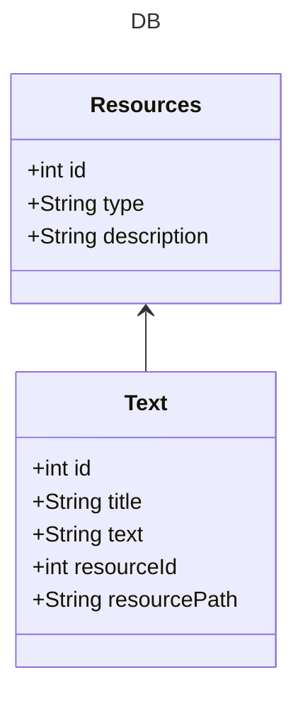

# Summary Project

## Database Scheme

```mermaid
---
title: DB
---

classDiagram

    Resources <-- Text

    class Resources {
        +int id
        +String type
        +String description
    }

    class Text {
        +int id
        +String title
        +String text
        +int resourceId
        +String resourcePath
    }
```
